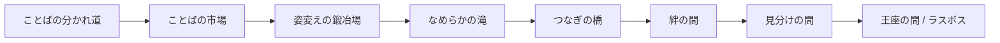

# 日本語文法学習アプリ「パクっと国文法」仕様書

2026年9月更新版

中学生向け日本語文法学習Webアプリの企画仕様書。Claude Codeへの実装依頼のベースとして使用する。

## 1. プロジェクト概要

大学のデジタルコンテンツ制作の授業課題として、Claude Codeでアプリ開発を行う。中学生向けに日本語文法学習ができるWebアプリを制作する。

**目的・到達目標**
- 高校入試に出題される文法問題に答えられる力を身につけさせる
- 対象は勉強が苦手な中学3年生(アルバイト先の生徒を主に想定)。使うだけで自然と定着する設計を優先する

**要件**
- Webアプリ化し、スマートフォン・パソコンの両方で動作すること

**発表会でのデモプレイ(最重要要件)**:提出後に発表会があり、その場でデモプレイを行う。あわよくばURLから他の受講生もプレイできるようにする。**このデモが失敗すると単位を落とす**ため、公開URLの安定動作は機能の作り込みよりも優先度が高い。GitHubでのソースコード公開は必須ではないが、可能なら行う(優先度は中)。

**評価の加点減点要素への対応方針**

注:表内の番号(44〜50)は、授業の採点基準表におけるその項目の通し番号であり、加点・減点の点数ではない。

| No. | 区分 | 内容 | このアプリでの対応 |
| --- | --- | --- | --- |
| 44 | 加点 | ルールや操作方法が直感的で、迷わず始められる | 出題エンジンは初回プレイ時のみ操作ガイドを表示、ふりがな対応で読みのハードルを下げる |
| 45 | 加点 | 仕組みと学習内容がかみ合っており、使うほど学びになる設計 | 単元の意味を舞台・キャラ設定に対応させる、間違えた問題を通常ステージに自然に混在させて復習させる |
| 46 | 加点 | 得点・レベル・ランキング等、挑戦意欲を高める仕掛けがある | クラス内ランキング、マスコットの成長、称号・図鑑(ことだまの書) |
| 47 | 加点 | 既存アプリの模倣にとどまらない、独自性・創意工夫の高い発想 | マスコットの正体をめぐるストーリー、役職ヒエラルキー型の小ボス、学習進捗と連動した育成要素 |
| 48 | 減点 | 操作説明が不足しており、何をすればよいか分からない | 各出題エンジンの初回プレイ時にガイドを必須で挟む |
| 49 | 減点 | バグや誤作動があり、最後まで正常に動作しない | 出題データを駆動データ化、Firestoreセキュリティルールの設定、モバイルの音声自動再生制約への対応を必須要件化 |
| 50 | 減点 | 使用した音源や図像について出典が記載されていない | 画像・音源をすべて素材管理表で一元管理し、提出物に同梱。ゲーム内クレジット画面(ASSET_CREDITS.mdを読み込む方式)でも出典を確認できる |

## 2. 世界観・ストーリー

**世界**:コトノハ王国(仮称)。ある日「言葉の乱れ」が広がり始め、看板の文字が消えかけたり会話が噛み合わなくなったりしている。ら抜き言葉・二重敬語など、実在する言葉の乱れが黒幕の力の源という設定にし、フィクションと実際の文法知識をリンクさせる。

**主人公**:見習いのことだま使い(プレイヤー自身)。台詞を持たない(喋らない)。必要な場面はナレーションで行動を描写する(例:「○○は、黙ってうなずいた」)。台詞・見た目とも軽量に保つ方針。専用の名前設定ステップは持たず、ランキングのニックネームをそのままプレイヤーの呼び名として使い回す。

**相棒**:丸っこくて浮遊する食いしん坊マスコット。正しい言葉を食べて力にし、少しずつ成長する。実は玉座を奪われた王女で、呪いによって今の姿になり記憶も部分的に曖昧(なんとなく覚えている程度の既視感)。お城の絵の前で様子がおかしくなる、玉座の間で頭を抱える、といった小さな違和感を随所で見せる程度に留め、伏線は匂わせるだけにする。

**黒幕**:玉座に入り込んだ、言葉の乱れそのものを象徴する存在。各エリアの小ボスはその手下(元は宮廷の役職者だった者たち)。

**黒幕の見た目(確定)**:人格を持たない、輪郭が定まらない影のような存在として描く。人型のシルエットはあるが、輪郭の一部が判読できない文字・記号のようなノイズになって崩れている(「言葉になろうとしてなれない」ことの視覚化)。色は黒〜濃い紫のグラデーションで、コレット・小ボスたちの暖色系パレットと対照的な寒色にする。目・口はあえて描かず、表情・意思疎通を持たない存在であることを強調する。玉座に溶け込むように座した構図を基本とする。ラスボス(乱れに飲まれた王様)とは別物として扱うが、王様の「取り憑かれた姿」にはこの黒幕のモチーフ(輪郭が崩れた影)をシルエットに重ねる形でデザインの整合性を取る。

**小ボスが乱れる仕組み(仮確定)**:黒幕から溢れ出た「言葉の乱れ」が霧のように城の人々に取り憑き、話し方を歪める。取り憑かれた者はやがて乱れそのものに動かされる存在(=小ボス)になってしまう。プレイヤーが倒すことは王様と同様「倒す」ではなく「浄化する」行為であり、浄化されると本来の話し方と自我を取り戻すが、取り憑かれていた間の記憶はおぼろげになる。

**宰相(ニジュヴェール)の特別な位置づけ(確定)**:他の小ボスと違い、単なる被害者ではなく、自ら「乱れ」の力に手を出した張本人とする。動機は悪意ではなく潔癖さの暴走:「言葉の変化(ら抜き言葉のような自然な移り変わり)」と「言葉の崩壊(伝わらなくなる混乱)」を混同し、あらゆる変化を根絶やしにしようとして、本物の「乱れ」の力を取り込んでしまった。浄化後、この取り違えに自ら気づく台詞で締める:

> 宰相:言葉は……生きているものだと、忘れていました。変わっていくことと、壊れていくことは、違うのに。

これにより、「学校文法=唯一絶対の正解」ではなく「今回はルールとして学ぶが、言葉自体はもっと自由で生きたもの」というテーマ性を、物語の着地点として提示する。

**クライマックス**:全エリアクリア後、王座の間で真相がまとめて明かされる(マスコット=本来の王女であったこと)。ラスボス撃破後、マスコットが本来の姿を一瞬取り戻す演出でエンディングを迎える。

**王様の結末**:黒幕(言葉の乱れ)に取り憑かれていた王様は、ラスボス撃破と同時に浄化され、元の姿・人格に戻る。撃破は「倒す」のではなく「浄化する」という扱いにし、最後まで重すぎないトーンを保つ。エンディングでは、正気を取り戻した王様とマスコット(実の子)が再会する場面を描く。

**王様の名前(確定)**:ヴェルバルト。ラテン語で「言葉」を意味するverbum + 西洋の王族名に使われる接尾辞-bald(「強力な・支配者」の意)に由来。娘コレット(和語「言」由来)と対になる形で、「言葉を司る王家」という血統の一貫性を持たせている。

**変身のタイミング**:マスコットが本来の姿を取り戻すのは、ラスボス撃破・王様の浄化と同時。宰相撃破時に淡く光り始める演出で予兆を出し、ラスボス撃破の瞬間に完全な姿に戻ることで、王様の浄化とマスコットの正体判明という2つの真実が同時に明らかになる構成にする。

**クライマックスの一枚絵**:マスコットの本来の姿と、浄化された王様の再会シーンを1枚絵として見せる。マスコットの本来の姿(単体)、浄化された王様(単体)をそれぞれ別々に生成し、共通の背景(王座の間)の上に画像編集で合成する方式で作る。

**主人公とマスコットの結び**:エンディングは恋愛(結婚)ではなく、信頼・絆で締める(正体を取り戻したマスコットに、側近・特別な仲間として認められる形)。

**マスコットの名前・性別(確定)**:女性(王女)。普段の呼び名は「コト」、正体判明後の正式名は「コレット」。「コレット」は和名「言(こと)」+西洋風の女性名接尾辞(-ette)に由来する。オッドアイは検討したが撤回し、両目とも通常の暖かみのある茶色で統一している(王族であることの示唆は、耳先・しっぽの金で担保)。

**頭の葉のモチーフの名前(確定):コトノ葉**。「言の葉(ことのは)」という実在の古語(「言葉」を意味する雅語)に由来。マスコットの愛称「コト」、世界の名前「コトノハ王国」、頭の葉の名前「コトノ葉」が、いずれも同じ古語「言の葉」から一直線につながる設定になっている。

**物語に厚みを持たせる仕掛け(検討)**:クライマックス付近に、プレイヤー自身の選択が物語に反映される軽い分岐を1箇所だけ用意する(下記エンディング称号に反映)。本格的な分岐シナリオは工数が大きいため範囲外とする。

**エンディング称号(確定)**:王座の間の選択に応じて、主人公に以下の称号(二つ名)を付与する。
- 選択肢A(城に戻る):「言葉を結びし者」
- 選択肢B(旅を続ける):「風のことだま使い」

**伏線の出し方(確定版)**:マスコットの既視感演出は、小ボス撃破後6回のうち2回のみに絞る(連続させない)。台詞での直接的な示唆は避け、しぐさ・間・表情のみで見せる。

| エリア | 小ボス撃破後の出来事 |
| --- | --- |
| ことばの市場 | 侍女見習いを撃破。特に反応なし |
| 姿変えの鍛冶場 | 鍛冶見習いを撃破。相棒、炎を見て一瞬だけ動きが止まる(既視感①・台詞なし、間のみ) |
| なめらかの滝 | 文官を撃破。特に反応なし |
| つなぎの橋 | メイド長を撃破。相棒、妙に丁寧に扱われて居心地悪そうにする(既視感②・軽い違和感の台詞のみ) |
| 絆の間 | 騎士団長を撃破。特に反応なし |
| 見分けの間 | 大臣を撃破。特に反応なし |
| 王座の間 | 宰相を撃破。ここで初めてまとまった形で真相が明らかになる |

**トーン**:王道RPGの筋書きをベースに、ビジュアル・キャラクター性はポップで可愛い方向性(リラックマ・すみっコぐらし・ポケモン的な親しみやすさ)を狙う。世界観の一貫性を保つため、出題エンジンのジャンルが変わっても「同じ王国内の別施設を訪れている」という体裁を崩さない。

## 3. エリア構成とステージ進行フロー

**エリア一覧**

| 順 | エリア名 | 単元(大分類) | 小ボス(役職) | 位置づけ |
| --- | --- | --- | --- | --- |
| 序章 | ことばの分かれ道 | 文節・単語 | なし | 村の外 |
| 1 | ことばの市場 | 品詞分類・自立語/付属語 | 侍女見習い | 村 |
| 2 | 姿変えの鍛冶場 | 動詞・形容詞・形容動詞の活用 | 鍛冶見習い | 村はずれ |
| 3 | なめらかの滝 | 音便・可能動詞など | 文官 | 郊外 |
| 4 | つなぎの橋 | 助詞の種類 | メイド長 | 城への道 |
| 5 | 絆の間 | 文節相互の関係 | 騎士団長 | 城内(1部屋目) |
| 6 | 見分けの間 | 助動詞・紛らわしい語の識別 | 大臣 | 城内(2部屋目) |
| 7 | 王座の間 | 敬語 | 宰相→王様(ラスボス) | 城内(最奥) |

小ボスの役職は村はずれの侍女見習いから城の最奥の宰相まで、進むごとに宮廷内での階級が上がっていく。ビジュアルも「乱れに侵された宮廷人」という共通ベースに、階級が上がるほど装飾(金の縁取り・勲章・マントなど)を増やして格の違いを表現する。

**小ボスの乱れ方**

| 小ボス | エリア | 乱れ方の例 | 対応する実在の現象 |
| --- | --- | --- | --- |
| 侍女見習い | ことばの市場 | 物の種類・呼び方があやふやで要領を得ない話し方 | 品詞の混同 |
| 鍛冶見習い | 姿変えの鍛冶場 | 「食べれる」「見れる」のように活用を省略する | ら抜き言葉 |
| 文官 | なめらかの滝 | 「言いた」「歩きた」のように音がなめらかに変化しきらない | 音便の未定着 |
| メイド長 | つなぎの橋 | 「紅茶、お持ちしました」のように助詞を省いて話す | 助詞の脱落 |
| 騎士団長 | 絆の間 | 「私の誇りは、剣を極めたいのです」のように主語と述語が噛み合わない | ねじれ文 |
| 大臣 | 見分けの間 | 「行かさせていただきます」のように余計な「さ」を入れる | さ入れ言葉 |
| 宰相 | 王座の間 | 「おっしゃられる」のように敬語を二重に重ねる | 二重敬語 |

**登場キャラクター名一覧**

| 役職/正体 | 名前 | 由来 |
| --- | --- | --- |
| 相棒(正体:王女) | コレット(愛称:コト) | 和名「言(こと)」+ 西洋女性名接尾辞(-ette) |
| 王様 | ヴェルバルト | ラテン語「verbum(言葉)」+ 王族名接尾辞-bald |
| 侍女見習い | メイ | 名詞(めいし) |
| 鍛冶見習い | レル | 助動詞「れる」 |
| 文官 | オンヴィン | 音便(おんびん) |
| メイド長 | ジョゼット | 助詞(じょし)+ 仏女性名 |
| 騎士団長 | ネジラルド | ねじれ + ジェラルド等 |
| 大臣 | サイラス | さ入れ + 西洋名(Silas) |
| 宰相 | ニジュヴェール | 二重(にじゅう)+ 貴族風語尾 |

**全体の進行フロー**

**1エリア内のステージ構造**

- 通常ステージ:1ステージ8〜10問。単元内でも出題エンジン(仕分け・組み立て・選択式)を小刻みに切り替え、テンポを重視する
- 小ボス:そのエリアでこれまでに学んだ内容を複合出題する中間復習ステージ
- ラスボス(王座の間のみ):全エリアの内容を複合出題する総仕上げステージ

**演出**:ステージ間のストーリーテキストは短く、必ずスキップ可能にする。クリアごとに達成演出+進捗自動保存を行い、途中離脱してもすぐ再開できるようにする。

**勝敗の扱い(確定)**:「負け」という状態そのものを作らない。
- 通常ステージ:間違えても即座に正誤を示し次の問題へ進むだけ。「クリアできない」状態は存在しない
- 小ボス・ラスボス戦:HPゲージは手応え演出のための見た目であり、不正解でもプレイヤー側がダメージを受けることはない
- そのボスの問題プールを全て解いてもHPが0にならなかった場合、「ゲームオーバー」ではなく「もう少し」という前向きな表示でその場ですぐ再挑戦できる。再挑戦ごとに出題は入れ替わる
- 「コンティニュー」という概念自体が不要になる
- ラスボスのみ、直前の小ボス(宰相)をクリアしていないと挑戦できないロックをかける(物語上の順序を守るため)。それ以外のステージは自由に挑戦できる

**単調さを減らす工夫(確定)**:選択式クイズが中心という構造上の単調さを、テンポを落とさずに和らげるための低コストな演出。
- 連続正解のコンボ表示(2連続以上で表示、結果画面に最大連続数も出す)
- 正解演出は複数パターンをランダムに出し、直前と同じ演出を連続させない
- 正誤フィードバックのメッセージ・セリフにバリエーションを持たせる
- OSの「動きを減らす」設定では、アニメーションを止める

## 4. 出題単元マッピング

最終的には中学国語文法の全範囲を実装することを前提とする。

| エリア | 単元(細目) |
| --- | --- |
| ことばの分かれ道 | 文節、単語(区切りを選択式クイズで問う形式に変換) |
| ことばの市場 | 自立語・付属語の区別、活用の有無、品詞10種(動詞・形容詞・形容動詞・名詞〈体言〉・副詞・連体詞・接続詞・感動詞・助動詞・助詞) |
| 姿変えの鍛冶場 | 動詞の活用の種類(五段・上一段・下一段・カ行変格・サ行変格)、動詞の活用形(未然形・連用形・終止形・連体形・仮定形・命令形)、形容詞の活用、形容動詞の活用 |
| なめらかの滝 | 自動詞・他動詞、可能動詞、音便(イ音便・促音便・撥音便) |
| つなぎの橋 | 助詞の種類(格助詞・接続助詞・副助詞・終助詞) |
| 絆の間 | 文節相互の関係(主語・述語の関係、修飾・被修飾の関係、並立の関係、補助の関係、接続の関係、独立の関係)。文中の該当する文節を直接タップして選ばせる出題形式にする |
| 見分けの間 | 助動詞の種類・意味用法別識別、紛らわしい語の識別 |
| 王座の間 | 敬語(尊敬語・謙譲語・丁寧語)。場面説明を添えた選択式問題にする |

難しい漢字の文法用語(体言・用言・格助詞など)には全エリア共通でふりがなを付ける。副助詞に含めている「は・も」は、教科書によっては「係助詞」という別カテゴリで扱われることがあるが、本アプリでは4種類の助詞という設計のまま副助詞に含める。

## 5. 出題エンジン仕様

新しいエンジンを増やさず、以下3エンジンで全単元をカバーする。

| エンジン | 操作 | 主な対象単元 |
| --- | --- | --- |
| 仕分けゲーム | 単語・文節を流し、カゴなどに分類する | 品詞分類、自立語/付属語 |
| 組み立てパズル | カードの並べ替え・穴埋め | 活用、音便、助詞の穴埋め |
| 選択式(通常) | 選択肢をタップして選ぶ | 助動詞の識別、紛らわしい語、敬語(場面説明付き) |
| 選択式(文中タップ) | 文中の該当する語・文節を直接タップして選ぶ | 文節相互の関係 |

「文中タップ」は独立した新規エンジンとして実装せず、選択式エンジン(ChoiceEngine)の表示モードの1つとして実装する。

**エンジン×エリアの世界観演出(確定)**:各エリアの物語を「敵と戦う」ではなく「困っている人やものを助ける」体裁に寄せているため、通常ステージの出題エンジンは全てバトルではなく「お手伝い」として演出する。バトル演出が必要なのは小ボス・ラスボス戦のみ。

| エリア | エンジン | 世界観上の位置づけ | 画面上の呼び名案 |
| --- | --- | --- | --- |
| ことばの分かれ道 | 選択式 | 見習いとして最初の心得を試される | ことだま使いの心得 |
| ことばの市場 | 仕分け | 品物(言葉)を正しい棚に並べ直し、商売を助ける | 棚卸しを手伝う |
| 姿変えの鍛冶場 | 組み立て | 金属を打って正しい形に鍛え直す | 型を打つ |
| なめらかの滝(自動詞・他動詞) | 仕分け | 川の流れを2つの水路に正しく振り分け、詰まりを解消する | 水路を切り分ける |
| なめらかの滝(可能動詞・音便) | 組み立て | 引っかかった水の流れをなめらかに整える | 流れをなめらかにする |
| つなぎの橋(格助詞) | 組み立て | 抜け落ちた橋板を正しい場所にはめ込む | 橋板をかける |
| つなぎの橋(接続助詞等) | 選択式 | 橋の番人に正しいつなぎ言葉を答えて通してもらう | 番人の問い |
| 絆の間 | 文中タップ | 見えなくなった関係の糸を指でなぞって結び直す | 絆の糸をたどる |
| 見分けの間 | 選択式 | 大臣の言葉のすり替えを、レンズ越しに見破る | まやかしを見破る |
| 王座の間 | 選択式(場面) | 宮廷作法の試験官として、正しい言葉遣いを判定する | 作法の間 |

**品詞の色分け**:仕分け・識別を問う問題では色を表示しない。すでに正解が確定した後の復習画面・図鑑画面でのみ品詞ごとの色を表示する。色だけに頼らず、必ず品詞名の文字を添える。

**データ設計方針**:単元内でエンジンを混在させるため、問題データは各エンジン共通のフォーマットで保持し、各問題データが自身の描画エンジンを指定する構造にする。

**出題選定ロジック(確定)**:
- 層化抽出:単元ごとにまず候補を均等に確保してから、ステージの出題セットを組み立てる
- 直近出題の除外:直近で出した問題は一定期間再度選ばれないようにする
- 連続回避:同一単元の問題が3問以上連続しないようシャッフル制約をかける
- 星(復習)システムとの整合:星の問題は上記の抽出ルールとは別枠で、一定割合を毎ステージ自然に混ぜ込む

## 6. マスコット成長・復習システム

**成長トリガー**:エリアクリアごとにマスコットのベースの姿(体格・つや)が成長する。人型に近づけていく描写はせず、生き物のまま大きく・豪華になる程度に留める。

**アセット方式**:ベース画像1枚+アクセサリー画像を重ねて表示するレイヤー方式を採用する。

**成長アクセサリー7段階(確定)**:既存パレット(アイボリー・ミント・ゴールド)に統一し、進むごとに「王族の証」らしさが強まる構成にする。

| 順 | エリア | アクセサリー | 装着位置 | 意匠 |
| --- | --- | --- | --- | --- |
| 1 | ことばの市場 | 小さな布のポーチ | 片方の肩から斜め掛け | アイボリーの布地にミント色の刺繍のステッチ、小さな金のボタン留め |
| 2 | 姿変えの鍛冶場 | 小さな腕輪 | 前足の片方 | 金色のバングル、中央に小さなミント色の石 |
| 3 | なめらかの滝 | 首元のスカーフ | 首周り | ミント色の小さなスカーフ、縁取りに金の細いライン |
| 4 | つなぎの橋 | 小さなブローチ | 胸元(首の下あたり) | コトノ葉と同じ葉の形をした金色のブローチ、中央に小さなミントの石 |
| 5 | 絆の間 | リボン | 片耳の付け根 | アイボリーのリボン、縁を金の糸で縁取り |
| 6 | 見分けの間 | 片眼鏡風の飾り | 片目の上 | 金縁の丸い飾り、細いチェーンで耳元と接続。レンズはうっすらミント色がかった透明 |
| 7 | 王座の間(最終) | 王冠のかけら | コトノ葉のすぐそば(頭頂部) | 小さな金の冠の欠片、中央に小さなミントの石。正体判明前の伏線として、あくまで欠片に留める |

各アクセサリーは独立した透過PNGとして作成し、指定の装着位置にレイヤーとして重ねる。

**復習システム**
- 間違えた問題には自動で星がつく(お気に入り登録も可能)
- 星のついた問題はマスコットの好物という設定にし、克服(正解し直す)すると星が外れ、克服ボーナス音が鳴る(図鑑の正答率にも反映される)。マスコットのアクセサリーは克服では増えない(アクセサリーはエリアクリア時のみ付与する。7段階)
- 星の問題は独立した復習モードに行かなくても、通常ステージの出題に一定割合で自然に混入させる
- ホーム画面にマスコットがお腹を空かせている、といった軽いバッジ通知を出す

**苦手単元の可視化・自由練習(確定・実装済み)**:「ことだまの書(図鑑)」に、単元ごとの正答率を横棒グラフで一覧表示する。各単元の行をタップすると、ストーリー演出やHPゲージなしの、その単元の問題プールだけを解く自由練習セッションに直接入れる。単元別正答率の集計は、累計ではなく直近N問(目安:単元ごとに直近10問)ベースで算出する(今の苦手を反映するため)。

**図鑑の拡張(実装済み)**:「ことばの ずかん」ページを実装。エリアをクリアすると、そのエリアで学んだ用語の説明と例文が1ページずつ開く(未クリアはロック表示)。

**本来の姿(真エンディング用)**:正体が明かされる終盤の1カットのみ、別枠でイラストを用意する。髪色・瞳の色・コトノ葉・配色(アイボリー+パステルミント+金)を動物時代から引き継ぐ方針。

## 7. サウンド・アクセシビリティ方針

- BGM・効果音を両方使用する。初回起動時はデフォルトで音ありとする
- BGM・効果音は個別に音量調整できるスライダーを設定画面に用意する
- ミュートへの導線は画面端の固定アイコンに配置する
- すべての効果音イベントには、必ず対応する視覚的フィードバックを用意し、無音でも意味が伝わるようにする
- セリフの音声読み上げは実装しない
- 難しい漢字の文法用語にはふりがな(ルビ)を表示する
- 品詞の色分けは、識別・分類を問う問題では非表示にし、復習・図鑑画面でのみ表示する
- モバイルの音声自動再生制約(iOS Safari等)に対応し、最初の1タップで音声を解禁する。BGMはオフラインでは再生しない(効果音はオフラインでも再生可能)

## 8. ランキング・データ設計

Firebase(無料のSparkプラン)+ Firestoreを使用する。

- **認証**:匿名認証+ニックネーム。個人情報を扱わない
- **参加方法**:クラスコード(合言葉)を入力してグループに参加する
- **データ**:Firestoreに「クラスコード / ニックネーム / 累計得点」を保存する
- **ランキング表示**:同じクラスコードのグループ内のみに限定する
- **ニックネームの安全対策**:NGワードチェックを実装する
- **セキュリティ**:Firestoreセキュリティルールを設定(得点は減らせない、上限あり、他人のデータは書き換え不可)。本番Firestoreでの動作確認済み

**スコア・期間・クラスコード形式(確定)**
- スコア基準:累計得点(ステージクリアごとに10点×正解数)
- 期間:累計のみ。週間ランキングなどの期間区切りは設けない
- クラスコード形式:数字4桁などの固定形式にはせず、先生が自由に決められる短い文字列(2〜20文字、合言葉)

## 9. 技術要件

- **PWA化**:Service Workerでオフラインキャッシュを実装。問題を解くコア機能はオフラインでも動作する(実装・実機確認済み)
- **モバイルの音声自動再生制約**:タイトル画面などで最初の1タップを挟んでから音声を解禁する
- **ホスティング**:Firebase Hosting(https://paku-kokubunpo.web.app にて公開中)
- **データ駆動設計**:出題データをコードから分離し、単元を追加する際はデータ追加のみで対応できる構造にする
- **レスポンシブ対応**:スマートフォン・パソコンの両方でレイアウトが崩れないようにする
- **ふりがな表示**:HTMLのrubyタグで実装する
- **ソースコード公開**:GitHubでの公開を進行中(Public)。OneDrive配下での`.git`運用は同期競合のリスクがあるため、公開後は別ディレクトリにcloneして作業する

## 10. 素材管理ルール

絵を描く技能がないため、キャラクター・背景はAI生成またはフリー素材を使用する。以下の一覧表で画像・BGM・効果音をすべて一元管理し、提出物に同梱する。

| 素材名 | 種別(画像/BGM/SE) | 出典・生成方法 | ライセンス | 使用箇所 |
| --- | --- | --- | --- | --- |
| (例)相棒_通常.png | 画像 | 生成AIツール名を記載 | 利用規約確認済み | マスコット全般 |

**運用上の注意**
- マスコットは表情差分を5〜6パターン程度に絞って先に確定させ、以降は使い回す
- 小ボスは「乱れに侵された宮廷人」の共通ベース+役職ごとの装飾差分というレイヤー方式にする
- 背景画像は比較的量産しやすい

**ゲーム内でのクレジット表示(実装済み)**:`docs/ASSET_CREDITS.md`の表をビルド時に読み込み、ゲーム内クレジット画面(タイトル・設定・エンディング後から開ける)に表示する。表に1行足せばゲーム内にも反映される。

**配色・フォント(確定)**

フォント:M PLUS Rounded 1c(全画面共通。SIL Open Font Licenseとしてクレジットに記載)

基本UIカラー:

| 用途 | 色 |
| --- | --- |
| 背景ベース | クリーム(生成り) |
| メインアクセント | パステルミント |
| 特別アクセント(称号・ランキング上位など) | 淡いゴールド |
| 文字色 | 温かみのある焦げ茶(純黒は使わない) |

エリアごとのアクセントカラー(マップ・ステージ選択画面での識別用):

| エリア | 色 |
| --- | --- |
| ことばの分かれ道 | 淡いグリーン |
| ことばの市場 | マスタードイエロー |
| 姿変えの鍛冶場 | 淡いオレンジ |
| なめらかの滝 | 淡いブルー |
| つなぎの橋 | ウッドブラウン(タン) |
| 絆の間 | 淡いローズピンク |
| 見分けの間 | 淡いラベンダー |
| 王座の間 | ディープゴールド |

**コレットの基準デザイン(確定)**:Illustrious-XL v2.0 + LoRA「Chibi Lerasigma 228 style」(トリガーワード`LeraDominator55`)、Seed 926951816 で生成した個体を基準デザインとして採用する。

**素材制作ワークフロー**:コトノ葉(頭の葉)としっぽの配色は、生成プロンプトでの直接指定ではなく、Gemini(会話形式の画像部分編集)で合成・調整する方式に確定した。狭い面積(耳の内側など)への色指定は、AI生成でもGeminiでの部分編集でも変化が伝わりにくく、広い面積(しっぽ全体など)を狙う方が成功率が高いという知見を得ている。

**コレット完成版デザイン(確定)**
- コトノ葉:額の上に、茎が巻いた葉脈入りの葉の形で乗せる
- しっぽ:付け根側から焦げ茶(ベタ塗り)→中間に幅広めのパステルミント(ベタ塗り)→先端に金(ベタ塗り)の3帯構成。境界はなめらかな曲線にする(ギザギザ・炎状は避ける)
- 目:オッドアイは撤回し、両目とも通常の暖かみのある茶色で統一

**表情・ポーズ差分(完成)**:通常/喜び/しょんぼり/もぐもぐ/びっくり/眠そうの6種が完成。

## 11. MVP範囲・優先順位

**MVP対象(実装完了)**:序章+ことばの市場+姿変えの鍛冶場の3エリアを最優先で完成させ、出題エンジン・マスコット成長・復習システム・ランキング・ストーリー演出など全機能を実装した。

実装状況の詳細は[docs/SPEC_STATUS.md](docs/SPEC_STATUS.md)を参照。

## 12. 未決事項

- [ ] 黒幕の見た目デザインは確定済み(2章参照)。画像生成のプロンプト化が残タスク
- [x] 薄い単元の追加出題データ(自動詞他動詞・なめらかの滝・王座の間・丁寧語)をClaude Codeに受け渡し・組み込み
- [ ] 必要なデザイン・音源の一覧の最終確定(13章のたたき台を参照)
- [ ] 実際の生徒(アルバイト先)にMVPを触らせ、最後まで遊び続けられるか・どこで飽きるかを確認する
- [x] GitHubリポジトリにライセンス(LICENSE)を付けるかどうかの決定

## 13. 必要素材一覧(たたき台)

**画像**

| 分類 | 内容 | 目安数 |
| --- | --- | --- |
| タイトル・UI | タイトルロゴ、ボタン・アイコン類、進捗バー、称号バッジ | 一式 |
| マスコット | ベース1種+表情・ポーズ差分6種(完成)、成長アクセサリー7段階、本来の姿(真エンディング用、1枚) | 約15点 |
| 小ボス | 共通ベース1種+役職ごとの装飾差分7種 | 8点 |
| ラスボス | 王様(取り憑かれた姿/浄化後の元の姿の2種) | 2点 |
| 背景 | エリア背景8種(序章+7エリア) | 8点 |
| 図鑑 | ことだまの書、見開きデザイン | 1〜2点 |

**BGM**

| 用途 | 想定曲数 |
| --- | --- |
| タイトル画面 | 1 |
| 通常探索 | 1〜2 |
| 通常ステージ(出題中) | 1 |
| 小ボス戦 | 1 |
| ラスボス戦 | 1 |
| 真相演出(しっとり系) | 1 |
| エンディング | 1 |

**効果音(SE、実装済み・9種)**

- 正解音/不正解音
- ボタンタップ音
- ステージクリア音
- マスコット成長音(growth)
- 小ボス撃破音/ラスボス撃破音(lastBossClear)
- 図鑑ページ解放音(pageUnlock)
- 克服ボーナス音(bonus)
